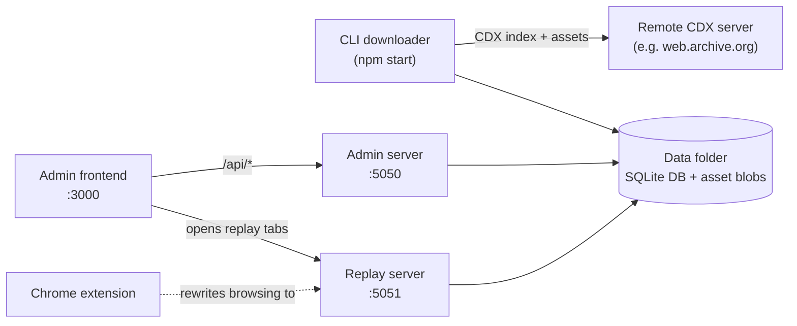

# Web Archive Workbench

Download, browse, search, and triage archived web content from CDX-backed
archives (Wayback Machine, pywb, and compatible servers) on your own machine.

## What it does

- **Download** archived snapshots of one or more domains via a CDX server,
  storing the assets and metadata locally in a single data folder.
- **Replay** the archived pages locally — browse them as if you were on the
  live web, with all subresources resolved against your local archive.
- **Search** across the bodies of archived assets with multiple regex
  conditions, including a "not-nearby" exclusion regex.
- **Triage** results by reacting to interesting files and filtering by
  domain, condition, or reaction.

## Components



| Component       | What it is                          | Default URL              |
| --------------- | ----------------------------------- | ------------------------ |
| CLI downloader  | Long-running command that fetches CDX entries and downloads assets | — (terminal)        |
| Admin server    | Fastify HTTP API over the database  | http://localhost:5050    |
| Admin frontend  | Next.js UI for the admin server     | http://localhost:3000    |
| Replay server   | Serves archived assets back as HTTP | http://localhost:5051    |
| Chrome extension| Rewrites browsing to the replay server, adds replay context menus | — (browser)         |

All components share a single **data folder** containing the SQLite database
and the downloaded asset files.

## Quick start (5 minutes)

Prerequisites: Node.js ≥ 22, Google Chrome (for replay), an empty directory
to use as your data folder.

```bash
# 1. Install dependencies
cd backend  && npm install
cd ../frontend && npm install

# 2. Download a domain (CLI). Stop with Ctrl+C when satisfied.
cd ../backend
npm start -- \
  --data-folder /path/to/data \
  --domain example.com \
  --max-req-per-second 1

# 3. In a second terminal, start the admin server.
npx tsx src/admin_server/index.ts --data-folder /path/to/data

# 4. In a third terminal, start the replay server.
npx tsx src/replay_server/server.ts --data-folder /path/to/data

# 5. In a fourth terminal, start the admin frontend.
cd ../frontend
npm run dev
```

Then:

1. Open <http://localhost:3000> — you should land on the **New Search** page.
2. Install the Chrome extension (see [docs/chrome-extension.md](docs/chrome-extension.md)).
3. From the admin frontend, browse to **Domains** → click your domain → open
   any replayed asset.

For a more detailed walkthrough, see [docs/quick-start.md](docs/quick-start.md).

## Documentation

- **Getting started**
  - [Quick start](docs/quick-start.md) — full 5-minute walkthrough
  - [Installation](docs/installation.md) — prerequisites and setup
  - [Configuration](docs/configuration.md) — ports, data folder, env vars
- **Components**
  - [CLI](docs/cli.md) — downloading and resyncing
  - [Admin server](docs/admin-server.md) — running and configuring the API
  - [Replay server](docs/replay-server.md) — serving archived content
  - [Admin frontend](docs/frontend.md) — every page explained
  - [Chrome extension](docs/chrome-extension.md) — install, verify, use
- **Day-to-day**
  - [Common workflows](docs/common-workflows.md) — end-to-end recipes
  - [Troubleshooting](docs/troubleshooting.md) — symptoms → fixes
  - [FAQ](docs/faq.md)
- [Screenshots](docs/screenshots.md)

## Core concepts

- **Domain** — a top-level target like `example.com`. CDX indexing and
  download progress are tracked per domain.
- **Resource** — a normalized URL (one entry per distinct page/asset).
- **Resource version** — a snapshot of a resource at a particular CDX
  timestamp. The same URL captured twice produces two versions.
- **Request** — a single download attempt for a resource version. May
  succeed, fail, or be a redirect to another version.
- **Run** — one invocation of the CLI. Every request, error, and new CDX
  entry is tagged with the run that produced it.
- **Search** — a set of regex conditions executed across all successful
  request bodies. Results are paginated and reactable.
- **Reaction** — a user-applied tag (e.g. 👍, ⭐) on a resource version, used
  for triage.
