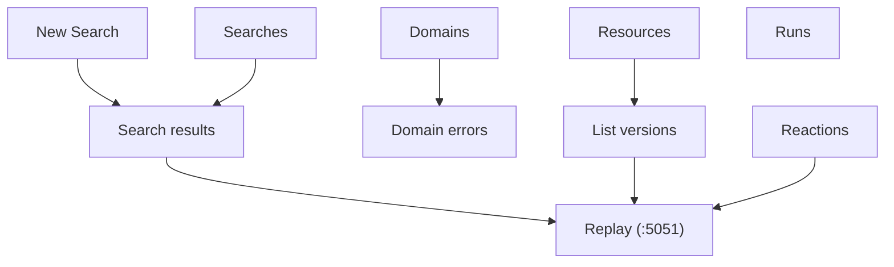

# Admin frontend

The frontend is a Next.js app served on <http://localhost:3000>. It talks
to the admin server at `:5050` (proxied through `/api/*`).

Start it with `npm run dev` from `frontend/`.

The top nav has six entry points: **New Search**, **Searches**, **Runs**,
**Resources**, **Domains**, **Reactions**. Three additional pages —
**Search results**, **List versions**, and **Domain errors** — are reached
by drilling in.

> Screenshot files are referenced as `docs/screenshots/<slug>.png`. Drop
> your images there with those filenames. The same list is consolidated
> in [screenshots.md](screenshots.md).

## New Search

`/search_form`

Start a search across the bodies of downloaded resources.

- **Purpose**: launch a new full-content search using one or more regex
  conditions across a chosen subset of domains.
- **How to access**: top nav → **New Search** (default landing page).
- **Common actions**:
  - Add/remove regex conditions. Each condition has:
    - a **regex** (executed case-insensitive, with the `g` flag),
    - an optional **not-nearby regex** that suppresses matches when found
      in the surrounding context window.
  - Toggle domains in/out of the search.
  - Submit to start the search.
- **Outcome**: redirects to [Search results](#search-results) once the
  search is queued. The search runs asynchronously.
- **Notes**: invalid regexes are caught client-side before submission.

## Searches

`/searches`

Lists every search you've ever run.

- **Purpose**: see the state of every search and jump back into one.
- **How to access**: top nav → **Searches**.
- **Common actions**:
  - Click a search to open its [Search results](#search-results).
  - Delete a search (also removes its stored results).
  - Toggle auto-refresh to poll while a search is running.
- **What you see per row**: status (done / running / error), how many files
  scanned, how many matched, the conditions used, and the domains targeted.

## Search results

`/search_results?search_id=<id>`

Where you actually look at matches.

- **Purpose**: browse, filter, and triage files matching a search.
- **How to access**: from **Searches**, or directly after submitting a
  search.
- **Common actions**:
  - **Filter** by domain, condition, or reaction type. Counts next to each
    filter reflect how many files would remain.
  - **Show similar files**: each file has a context-digest grouping; you
    can drill into "similar" sets that share the same surrounding text.
  - **React** to files using the configured reaction types (e.g. 👍, ⭐).
  - **Open the file** in the replay server.
  - **Page through** results with the cursor at the bottom.
- **Progress UI**: if the search is still running, a progress bar at the
  top shows scanned vs total files; the page auto-polls.

## Runs

`/runs`

Audit log of CLI invocations.

- **Purpose**: see when downloads happened, what arguments were used, how
  many entries were added, downloaded, or errored.
- **How to access**: top nav → **Runs**.
- **What you see per run**: run ID, timestamp, the arg list passed to the
  CLI, new-entry count, requested/downloaded/errored counts broken down
  per domain, and error types grouped by code.
- **Use case**: figure out which run introduced a batch of failures, or
  confirm a re-download produced the expected delta.

## Domains

`/domains`

Overview of every domain in your archive.

- **Purpose**: get per-domain totals at a glance.
- **How to access**: top nav → **Domains**.
- **What you see per row**: resource count, successful downloads, errored
  entries, pending entries.
- **Drill-down**: click the **errored** badge to jump into
  [Domain errors](#domain-errors) filtered to that domain.

## Domain errors

`/domain_errors?domain=<name>`

Every failed download for a domain, with filters.

- **Purpose**: triage download failures.
- **How to access**: **Domains** → click the errored badge on a row.
- **Common actions**:
  - Filter by **error code** (e.g. `451`, `connect_econnrefused`) or by
    **error name** (e.g. `network`, `http_status`). The full filter set is
    loaded from `/api/domains/error_filters`.
  - Scroll for more — infinite-scroll cursor pagination.
- **Outcome**: pick a class of errors, decide whether to re-run with
  `--skip-error` or with different proxy/network settings.

## Resources

`/resources`

Tree-style browser of all known URLs.

- **Purpose**: navigate by URL path segments (scheme/host/path components).
- **How to access**: top nav → **Resources**.
- **Common actions**:
  - Drill into a path segment to see its children.
  - At the leaf, click to open [List versions](#list-versions) for that
    URL.
- **Notes**: the tree is built from normalized URLs, so subdomains and
  paths group naturally.

## List versions

`/list_versions?url=<url>` or `?originalUrl=<url>`

Every snapshot of a single URL.

- **Purpose**: see every captured version of one resource and pick one to
  replay.
- **How to access**:
  - From [Resources](#resources) (click a leaf).
  - From the Chrome extension's **List versions** context menu on a
    replayed page.
- **What you see per row**: timestamp, status (ok / redirect / error /
  pending), the redirect target (if any), and the error message (if any).
- **Common actions**:
  - Open a successful snapshot in the replay server.
  - Inspect an error to decide whether to retry.

## Reactions

`/reactions_view?reaction_type_id=<id>`

The files you've reacted to, grouped by reaction type.

- **Purpose**: a triage queue. After a search you mark interesting files
  with a reaction; this page surfaces all such files later.
- **How to access**: top nav → **Reactions**.
- **Common actions**:
  - Switch the active reaction type (e.g. 👍, ⭐).
  - Filter by domain.
  - Page through results.
  - Open a file in the replay server.
  - Toggle other reaction types on a file.

## Navigation cheat-sheet

## Behavior notes

- Every page is **`force-dynamic`** — there's no caching between requests.
- Long lists use **cursor-based infinite scroll**, not page numbers
  (except the Reactions page, which uses paged navigation).
- All write actions (start search, delete search, toggle reaction) are
  optimistic only where shown; otherwise the page reloads after the
  request resolves.
