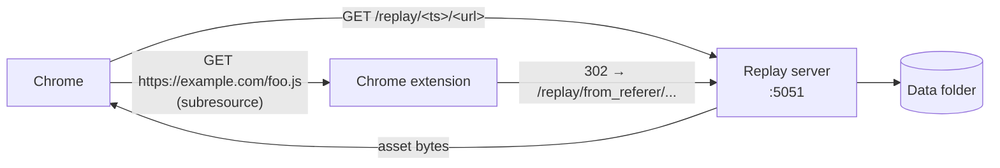

# Replay server

The replay server serves downloaded HTML, CSS, JS, images, etc. back to
your browser. Together with the Chrome extension it makes archived pages
load locally as if they were live.



## Running

From `backend/`:

```bash
npx tsx src/replay_server/server.ts --data-folder /path/to/data
```

**Expected output**: `Listening on http://localhost:5051`.

## Options

| Argument               | Default                  | Description |
| ---------------------- | ------------------------ | ----------- |
| `--data-folder`, `-b`  | —                        | **Required.** Same folder as the CLI. |
| `--admin-url`          | `http://localhost:3000`  | Used only for cross-link defaults. |

## How replay URLs work

A replay URL has the form:

```
http://localhost:5051/replay/<14-digit-timestamp>/<original-url>
```

For example:

```
http://localhost:5051/replay/20230501120000/https://example.com/index.html
```

The server:

1. Looks up the closest stored snapshot. If the requested timestamp doesn't
   match the actual stored timestamp exactly, it redirects (302) to the
   canonical one.
2. If the snapshot is itself a redirect, it returns a 302 to the redirected
   resource version.
3. Otherwise it streams the stored bytes with the original `Content-Type`.

It also appends an `x-remote-live-replay-url` header pointing at the
remote archive (e.g. `https://web.archive.org/web/20230501120000/...`) when
the original `--replay-base-url` is known. The Chrome extension reads this
to power the **Open in Remote Replay** context menu.

## How subresources are resolved

Stored HTML often references absolute URLs like
`https://cdn.example.com/style.css`. Your browser would normally fetch
those from the live web. The Chrome extension intervenes:

- Requests to the admin frontend, admin backend, or replay server origins
  are **allowed** as-is.
- A small allowlist for CDNs/fonts (jsDelivr, cdnjs, Google Fonts) and a
  few embedded-content domains is **allowed**.
- **Everything else** is rewritten to
  `http://localhost:5051/replay/from_referer/<original-url>`.
- The replay server's `/from_referer/*` endpoint reads the `Referer`
  header, extracts the timestamp of the page that requested the asset, and
  302s to the matching `/replay/<ts>/<url>`.

This means subresource requests don't need to know their own archive
timestamp — they inherit it from the page that linked to them.

## Relationship between components

| Component         | Role in replay                                                |
| ----------------- | ------------------------------------------------------------- |
| Replay server     | Serves bytes for `/replay/<ts>/<url>`. Resolves `from_referer`. |
| Chrome extension  | Rewrites all `localhost`-initiated traffic to the replay server, except for allowed origins. Without it, archived pages will reach for the live web. |
| Admin frontend    | Provides links into the replay server and offers per-page version lists. |
| Admin server      | Not used directly during replay. |

You **need** both the replay server and the Chrome extension for replay
to work correctly.

## Verifying the replay server

Visit a known URL directly:

```
http://localhost:5051/replay/<some-timestamp>/<some-archived-url>
```

You should get the stored content. If you get a 404, the snapshot isn't in
your database — see [troubleshooting.md](troubleshooting.md#404-on-a-replay-url).

## See also

- [Chrome extension](chrome-extension.md) — install and verify.
- [Troubleshooting](troubleshooting.md) — symptoms specific to replay.
